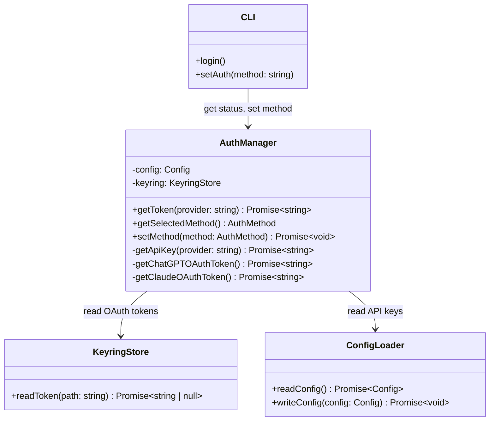

# Phase 4: Technical Design

**Phase:** Authentication Expansion
**Goal:** Add Claude OAuth token retrieval, implement auth method switching via CLI, verify all auth × provider combinations work correctly

---

## Integration Overview

(From TECH-APPROACH Section 5)

Phase 4 adds Claude OAuth token retrieval alongside the existing ChatGPT OAuth from Phase 5 port. We're not implementing OAuth flows—just reading tokens from ~/.claude keyring where Claude Code stores them after user authenticates. This extends the AuthManager to support four auth methods total: OpenAI API key, Anthropic API key, ChatGPT OAuth, Claude OAuth. CLI adds commands for auth method selection and login status display.

The integration is primarily configuration and token retrieval. AuthManager already has keyring integration from Phase 5 (for ChatGPT). We're adding a second keyring path for Claude tokens, reading from ~/.claude config/keyring (exact path discovered during implementation). Token refresh still manual (user re-authenticates in Claude Code when expired). No complex OAuth flow logic—just file/keyring reads.

Testing mocks keyring/filesystem reads. No real token files needed. Mock returns valid tokens for each auth method, verify AuthManager retrieves correctly, constructs proper auth headers for each provider. Test all auth × provider combinations, with special attention to OAuth validation: ChatGPT OAuth only tested with OpenAI Responses API, Claude OAuth only tested with Anthropic Messages API (these are the respective providers' primary APIs).

### Phase 4 Target State

```
User runs: cody login        (shows current auth)
           cody set-auth oauth-claude

┌──────────────────────────────────┐
│  CLI (Phase 1-3 + NEW)           │
│  ┌────────┐  ┌──────────────┐   │
│  │ login │  │  set-auth    │   │
│  │ (NEW) │  │    (NEW)     │   │
│  └───┬────┘  └──────┬───────┘   │
│      │              │            │
│      └──────────────┘            │
│             ▼                    │
│     Auth Config Update           │
└─────────────┬────────────────────┘
              ▼
┌──────────────────────────────────┐
│  AuthManager (Phase 5 + NEW)     │
│  ┌────────────────────────────┐  │
│  │  Token Retrieval (expanded)│  │
│  │  - API keys (EXISTS)       │  │
│  │  - ChatGPT OAuth (EXISTS)  │  │
│  │  - Claude OAuth (NEW)      │  │
│  └────────────────────────────┘  │
└──────────────┬───────────────────┘
               ▼
        ┌──────┴──────┐
        ▼             ▼
   ┌─────────┐  ┌──────────┐
   │ Keyring │  │  Config  │
   │  ~/.    │  │  .toml   │
   │ claude  │  │   file   │
   │ (NEW)   │  │(EXISTS)  │
   └─────────┘  └──────────┘
```

**Highlighted:** login and set-auth commands (NEW), Claude OAuth retrieval (NEW), dual keyring sources (ChatGPT from Phase 5, Claude added).

---

## Actual Signatures (from ported code)

### AuthManager

Location: `codex-ts/src/core/auth/index.ts`

```typescript
class AuthManager {
  constructor(config: Config, keyring?: KeyringStore)
  
  async getToken(provider: 'openai' | 'anthropic'): Promise<string>
  // Returns token based on configured auth method
  
  getSelectedMethod(): AuthMethod
  // Returns current auth method from config
  
  async setMethod(method: AuthMethod): Promise<void>
  // Updates config with new auth method
}

type AuthMethod = 
  | 'openai-api-key' 
  | 'anthropic-api-key' 
  | 'oauth-chatgpt' 
  | 'oauth-claude';
```

### KeyringStore

Location: `codex-ts/src/core/keyring-store/index.ts`

```typescript
class KeyringStore {
  async readToken(path: string): Promise<string | null>
  // Reads token from filesystem/keyring at path
  
  async writeToken(path: string, token: string): Promise<void>
  // Writes token (not used in Phase 4, but exists)
}
```

**For Phase 4:** We only read tokens (no writes). KeyringStore handles filesystem access, AuthManager orchestrates retrieval.

---

## Token Source Mapping

**Four auth methods, four token sources:**

| Auth Method | Provider | Token Source | Path |
|------------|----------|--------------|------|
| openai-api-key | openai | Config file | ~/.cody/config.toml (config.auth.openai_api_key) |
| anthropic-api-key | anthropic | Config file | ~/.cody/config.toml (config.auth.anthropic_api_key) |
| oauth-chatgpt | openai | ChatGPT CLI | ~/.codex/auth.json (where ChatGPT Pro CLI stores tokens) |
| oauth-claude | anthropic | Claude Code | ~/.claude/credentials.json (where Claude Code stores tokens) |

**Path discovery:** Exact Claude keyring path may vary. Check during implementation:
- ~/.claude/credentials.json
- ~/.claude/config/auth.json
- ~/.config/claude/credentials.json

Use KeyringStore to abstract path differences. Document actual path in DECISIONS.md.

---

## Technical Deltas

**New code (CLI layer):**
- src/cli/commands/login.ts: Display auth status (~60 lines)
- src/cli/commands/set-auth.ts: Switch auth method (~50 lines)

**New code (auth layer):**
- src/core/auth/claude-oauth.ts: Claude token retrieval (~50 lines)
- src/core/auth/auth-manager.ts: Extend with Claude OAuth support (~30 lines modification)

**New code (testing):**
- tests/mocked-service/phase-4-auth-methods.test.ts: Auth method tests (~120 lines)
- tests/mocks/keyring.ts: Mock keyring for both ChatGPT and Claude (~40 lines)

**Estimated new code:** ~350 lines total
- CLI commands: ~110 lines
- Auth layer: ~80 lines
- Mocked-service tests: ~160 lines

---

## AuthManager Token Retrieval Flow

**The routing logic:**

AuthManager.getToken(provider) checks the configured auth method and routes to appropriate retrieval function. Each method has specific logic for finding and extracting tokens.

```typescript
// In AuthManager
async getToken(provider: 'openai' | 'anthropic'): Promise<string> {
  const method = this.getSelectedMethod();
  
  // Route based on method
  switch (method) {
    case 'openai-api-key':
      if (provider !== 'openai') {
        throw new AuthError('OpenAI API key cannot be used with non-OpenAI providers');
      }
      return this.getApiKey('openai');
      
    case 'anthropic-api-key':
      if (provider !== 'anthropic') {
        throw new AuthError('Anthropic API key cannot be used with non-Anthropic providers');
      }
      return this.getApiKey('anthropic');
      
    case 'oauth-chatgpt':
      if (provider !== 'openai') {
        throw new AuthError('ChatGPT OAuth can only be used with OpenAI providers');
      }
      return this.getChatGPTOAuthToken();
      
    case 'oauth-claude':
      if (provider !== 'anthropic') {
        throw new AuthError('Claude OAuth can only be used with Anthropic providers');
      }
      return this.getClaudeOAuthToken();
      
    default:
      throw new AuthError(`Unknown auth method: ${method}`);
  }
}

private async getApiKey(provider: string): Promise<string> {
  const key = this.config.auth[`${provider}_api_key`];
  if (!key) {
    throw new AuthError(
      `Missing API key for ${provider}. ` +
      `Set in config: [auth]\n${provider}_api_key = "..."`
    );
  }
  return key;
}

private async getChatGPTOAuthToken(): Promise<string> {
  const path = '~/.codex/auth.json';
  const token = await this.keyring.readToken(path);
  if (!token) {
    throw new AuthError(
      'ChatGPT OAuth token not found. ' +
      'Log in via ChatGPT Pro CLI to refresh token.'
    );
  }
  return token;
}

private async getClaudeOAuthToken(): Promise<string> {
  // Try multiple possible paths
  const paths = [
    '~/.claude/credentials.json',
    '~/.claude/config/auth.json',
    '~/.config/claude/credentials.json'
  ];
  
  for (const path of paths) {
    const token = await this.keyring.readToken(path);
    if (token) {
      // Document which path worked in DECISIONS.md
      return token;
    }
  }
  
  throw new AuthError(
    'Claude OAuth token not found. ' +
    'Log in via Claude Code to refresh token. ' +
    'Searched: ' + paths.join(', ')
  );
}
```

**Error messages are actionable:** Tell user what's missing and how to fix it (which app to log into).

---

## CLI Command Implementation

### login Command

**Purpose:** Show auth status, help user understand what's configured and what's missing.

```typescript
// src/cli/commands/login.ts
import {program} from 'commander';
import {getAuthManager, loadConfig} from '../manager';

program
  .command('login')
  .description('Show authentication status')
  .action(async () => {
    const config = await loadConfig();
    const auth = getAuthManager();
    const current = auth.getSelectedMethod();
    
    console.log('\nAuthentication Status:\n');
    console.log(`Current method: ${current}\n`);
    
    // Check each method
    const methods = [
      {
        name: 'openai-api-key',
        check: async () => config.auth.openai_api_key ? '✓' : '✗',
        help: 'Set in config: [auth]\nopenai_api_key = "sk-..."'
      },
      {
        name: 'anthropic-api-key',
        check: async () => config.auth.anthropic_api_key ? '✓' : '✗',
        help: 'Set in config: [auth]\nanthropic_api_key = "sk-ant-..."'
      },
      {
        name: 'oauth-chatgpt',
        check: async () => {
          try {
            await auth.getChatGPTOAuthToken();
            return '✓';
          } catch {
            return '✗';
          }
        },
        help: 'Log in via ChatGPT Pro CLI to refresh'
      },
      {
        name: 'oauth-claude',
        check: async () => {
          try {
            await auth.getClaudeOAuthToken();
            return '✓';
          } catch {
            return '✗';
          }
        },
        help: 'Log in via Claude Code to refresh'
      }
    ];
    
    console.log('Available methods:\n');
    for (const method of methods) {
      const status = await method.check();
      const marker = method.name === current ? '→' : ' ';
      console.log(`${marker} ${status} ${method.name}`);
      if (status === '✗') {
        console.log(`      ${method.help}`);
      }
    }
    
    console.log();
  });
```

**UX:** Visual table showing all methods, checkmarks for available, arrows for current, help text for missing.

### set-auth Command

```typescript
// src/cli/commands/set-auth.ts
program
  .command('set-auth <method>')
  .description('Set authentication method')
  .action(async (method: string) => {
    const validMethods = [
      'openai-api-key',
      'anthropic-api-key', 
      'oauth-chatgpt',
      'oauth-claude'
    ];
    
    if (!validMethods.includes(method)) {
      console.error(`Invalid auth method '${method}'`);
      console.error(`Valid methods: ${validMethods.join(', ')}`);
      process.exit(1);
    }
    
    // Load config
    const config = await loadConfig();
    
    // Update method
    config.auth.method = method as AuthMethod;
    
    // If switching to API key method and key not set, prompt
    if (method.endsWith('-api-key')) {
      const provider = method.split('-')[0]; // 'openai' or 'anthropic'
      if (!config.auth[`${provider}_api_key`]) {
        console.log(`\nAPI key for ${provider} not configured.`);
        const rl = readline.createInterface({input: process.stdin, output: process.stdout});
        const key = await rl.question(`Enter ${provider} API key: `);
        rl.close();
        config.auth[`${provider}_api_key`] = key;
      }
    }
    
    // Save
    await saveConfig(config);
    
    console.log(`✓ Auth method set to ${method}`);
    
    // Verify token available
    try {
      const auth = new AuthManager(config);
      const provider = method.includes('openai') ? 'openai' : 'anthropic';
      await auth.getToken(provider);
      console.log(`✓ Token available for ${provider}`);
    } catch (err) {
      console.warn(`⚠ Warning: ${err.message}`);
    }
  });
```

**UX:** Validates method, optionally prompts for API key, verifies token available after switch.

---

## OAuth × API Validation

**Critical constraint:** OAuth methods only work with specific APIs.

**Valid combinations:**
- ChatGPT OAuth + OpenAI Responses API ✓
- ChatGPT OAuth + OpenAI Chat API ✓
- Claude OAuth + Anthropic Messages API ✓

**Invalid combinations:**
- ChatGPT OAuth + Anthropic Messages ✗ (wrong provider)
- Claude OAuth + OpenAI Responses ✗ (wrong provider)

**Why this matters:**

OAuth tokens are provider-specific. ChatGPT OAuth token is an OpenAI token (works with OpenAI APIs). Claude OAuth token is an Anthropic token (works with Anthropic APIs). Attempting to use ChatGPT OAuth with Anthropic will fail at API call time with 401 Unauthorized.

**Validation strategy:**

AuthManager.getToken() enforces this at token retrieval time (shown in code above). If method doesn't match provider, throw AuthError immediately. This gives user clear feedback before attempting API call.

**Testing focus:**

Manual tests verify these specific combinations:
- Test ChatGPT OAuth + Responses API (valid, should work)
- Test Claude OAuth + Messages API (valid, should work)
- Mocked tests verify error thrown for mismatched combinations

---

## Config File Updates

**Extended auth section:**

```toml
[auth]
method = "openai-api-key"           # Current auth method
openai_api_key = "sk-..."           # OpenAI API key
anthropic_api_key = "sk-ant-..."    # Anthropic API key

# OAuth tokens read from external CLI keyrings (not in Cody's config file)
# ChatGPT: ~/.codex/auth.json (where ChatGPT Pro CLI stores tokens)
# Claude: ~/.claude/credentials.json (where Claude Code stores tokens)
```

**Config loader changes:**
- Read auth.method field
- Provide default if missing (openai-api-key)
- Validate method is one of four valid values

**Config writer changes:**
- Update auth.method when set-auth called
- Preserve existing API keys when switching methods
- Atomic write (temp file + rename)

---

## Component Structure

AuthManager routes to four token sources. API keys come from config file. OAuth tokens come from keyring files. All methods return token string. ModelClient receives token without knowing source.



---

## Connection Points Detail

### CLI → AuthManager (Status Display)

**login command flow:**

User runs `cody login`. Command handler loads config, creates AuthManager instance. Calls auth.getSelectedMethod() to get current method. For each of four methods, attempts to retrieve token (wrapped in try/catch). If token retrieval succeeds, mark with ✓. If fails, mark with ✗ and show help text. Display table with current method highlighted.

**Purpose:** User sees what's configured, what's missing, how to fix missing tokens. Actionable status display.

### CLI → Config File (Method Selection)

**set-auth command flow:**

User runs `cody set-auth oauth-claude`. Command validates method name (must be one of four valid values). Loads current config. Updates config.auth.method field. If switching to API key method and key not present, prompts user to enter key interactively. Saves updated config. Attempts to verify token available (calls auth.getToken()), shows warning if not.

**Validation happens at two points:**
1. Command validates method name (prevents typos)
2. AuthManager validates provider match (prevents misuse)

### AuthManager → KeyringStore (OAuth Retrieval)

**ChatGPT OAuth retrieval:**

AuthManager calls keyring.readToken('~/.codex/auth.json'). KeyringStore reads file, parses JSON, extracts access_token field from the tokens object. Returns token string or null if file missing. AuthManager throws AuthError with helpful message if null.

**Claude OAuth retrieval:**

AuthManager tries multiple paths (Claude keyring location varies by installation). For each path, calls keyring.readToken(). Returns first successful read. If all paths fail, throws AuthError listing all paths tried and suggesting user log into Claude Code.

**Token format assumptions:**
- ChatGPT: JSON file with {access_token: "..."}
- Claude: JSON file with {access_token: "..."} or similar

**If format differs:** Adjust parsing in claude-oauth.ts. Document actual format in DECISIONS.md.

### AuthManager → Config File (API Keys)

**API key retrieval:**

AuthManager reads from config.auth.openai_api_key or config.auth.anthropic_api_key. Simple field access. If field missing or empty, throws AuthError with message showing how to set it.

**No keyring involved for API keys.** They live in config file only (user sets manually or via set-auth prompt).

---

## Error Handling

**Missing token errors:**

```typescript
// Missing API key
throw new AuthError(
  `Missing API key for ${provider}. ` +
  `Set in config: [auth]\n${provider}_api_key = "..."\n` +
  `Or run: cody set-auth ${provider}-api-key`
);

// Missing ChatGPT OAuth token
throw new AuthError(
  'ChatGPT OAuth token not found at ~/.codex/auth.json. ' +
  'Log in via ChatGPT Pro CLI to refresh token. ' +
  'Or switch to API key: cody set-auth openai-api-key'
);

// Missing Claude OAuth token
throw new AuthError(
  'Claude OAuth token not found. Searched:\n' +
  paths.map(p => `  - ${p}`).join('\n') + '\n' +
  'Log in via Claude Code to refresh token. ' +
  'Or switch to API key: cody set-auth anthropic-api-key'
);
```

**Provider mismatch errors:**

```typescript
// Using ChatGPT OAuth with Anthropic
throw new AuthError(
  'ChatGPT OAuth can only be used with OpenAI providers. ' +
  'Current provider: anthropic. ' +
  'Switch to OpenAI: cody set-provider openai'
);

// Using Claude OAuth with OpenAI
throw new AuthError(
  'Claude OAuth can only be used with Anthropic providers. ' +
  'Current provider: openai. ' +
  'Switch to Anthropic: cody set-provider anthropic'
);
```

**All errors actionable:** Tell user what's wrong and exactly how to fix it.

---

## Mock Implementation Guide

### Mock KeyringStore

For testing OAuth token retrieval without real keyring files:

```typescript
// tests/mocks/keyring.ts

export function createMockKeyring(tokens: Record<string, string | null>) {
  return {
    async readToken(path: string): Promise<string | null> {
      // Normalize path (expand ~)
      const normalized = path.replace('~', '/home/test');
      return tokens[normalized] ?? null;
    }
  } as KeyringStore;
}

// Usage in tests
const mockKeyring = createMockKeyring({
  '/home/test/.codex/auth.json': 'chatgpt-token-123',
  '/home/test/.claude/credentials.json': 'claude-token-456'
});

const auth = new AuthManager(config, mockKeyring);
```

**For negative tests:** Return null to simulate missing token files.

### Mock Config with Auth Fields

```typescript
// Test helper
function createTestConfig(authMethod: AuthMethod, keys?: Record<string, string>): Config {
  return {
    auth: {
      method: authMethod,
      openai_api_key: keys?.openai ?? '',
      anthropic_api_key: keys?.anthropic ?? ''
    },
    provider: {name: 'openai', api: 'responses', model: 'gpt-4'},
    // ... other config fields
  };
}

// Usage
const config = createTestConfig('openai-api-key', {openai: 'sk-test-key'});
```

---

## Reference Locations

**Ported auth code:**
- AuthManager: `codex-ts/src/core/auth/index.ts`
- KeyringStore: `codex-ts/src/core/keyring-store/index.ts`
- ChatGPT OAuth (existing): `codex-ts/src/core/auth/chatgpt-oauth.ts` (if separate file)

**Config system:**
- Config types: `codex-ts/src/core/config/types.ts`
- Config loader: `codex-ts/src/core/config-loader/index.ts`

**CLI commands:**
- Existing: `codex-ts/src/cli/commands/` (new, chat, set-provider from Phases 1-3)
- Add auth commands here

---

## Implementation Notes

**Key decisions to document in DECISIONS.md:**

1. **Claude keyring path:** Which of the three possible paths actually works? Document for future reference.

2. **Token format:** What's the actual JSON structure in ChatGPT and Claude keyring files? Document field names.

3. **Token refresh:** We're not implementing automatic refresh. User must re-authenticate manually when tokens expire. Document this limitation and user workflow.

4. **API key prompting:** When user switches to API key method and key not set, should we prompt interactively or just error? Recommend: prompt (better UX).

5. **Method validation:** Should we validate method at config save time or only at token retrieval time? Recommend: both (early feedback + safety check).

6. **OAuth token expiry:** How do we detect expired tokens? Recommend: let API call fail with 401, show helpful error message.

**Error message philosophy:** Every error should tell user:
- What went wrong
- Why it went wrong (if not obvious)
- Exactly how to fix it (specific command or action)

**CLI UX:** login command should be the go-to for "why isn't auth working?" Show status of all methods, highlight current, suggest fixes for missing.

---

## Verification Approach

### Mocked-Service Testing (Automated)

Tests in `tests/mocked-service/phase-4-auth-methods.test.ts` verify token routing with mocked keyring and config.

```typescript
describe('Phase 4: Authentication Methods', () => {
  describe('Token Retrieval', () => {
    it('retrieves OpenAI API key from config', async () => {
      const config = createTestConfig('openai-api-key', {openai: 'test-key-123'});
      const auth = new AuthManager(config);
      
      const token = await auth.getToken('openai');
      
      expect(token).toBe('test-key-123');
    });

    it('retrieves Anthropic API key from config', async () => {
      const config = createTestConfig('anthropic-api-key', {anthropic: 'test-key-456'});
      const auth = new AuthManager(config);
      
      const token = await auth.getToken('anthropic');
      
      expect(token).toBe('test-key-456');
    });

    it('retrieves ChatGPT OAuth token from keyring', async () => {
      const mockKeyring = createMockKeyring({
        '~/.codex/auth.json': 'chatgpt-oauth-token'
      });
      const config = createTestConfig('oauth-chatgpt');
      const auth = new AuthManager(config, mockKeyring);

      const token = await auth.getToken('openai');

      expect(token).toBe('chatgpt-oauth-token');
    });

    it('retrieves Claude OAuth token from keyring', async () => {
      const mockKeyring = createMockKeyring({
        '~/.claude/credentials.json': 'claude-oauth-token'
      });
      const config = createTestConfig('oauth-claude');
      const auth = new AuthManager(config, mockKeyring);
      
      const token = await auth.getToken('anthropic');
      
      expect(token).toBe('claude-oauth-token');
    });
  });

  describe('Error Cases', () => {
    it('throws when API key missing', async () => {
      const config = createTestConfig('openai-api-key', {}); // No keys
      const auth = new AuthManager(config);
      
      await expect(auth.getToken('openai')).rejects.toThrow('Missing API key');
    });

    it('throws when OAuth token missing', async () => {
      const mockKeyring = createMockKeyring({}); // No tokens
      const config = createTestConfig('oauth-claude');
      const auth = new AuthManager(config, mockKeyring);
      
      await expect(auth.getToken('anthropic')).rejects.toThrow('Claude OAuth token not found');
    });

    it('throws when provider mismatch (ChatGPT OAuth + Anthropic)', async () => {
      const mockKeyring = createMockKeyring({
        '~/.codex/auth.json': 'chatgpt-token'
      });
      const config = createTestConfig('oauth-chatgpt');
      const auth = new AuthManager(config, mockKeyring);

      await expect(auth.getToken('anthropic')).rejects.toThrow(
        'ChatGPT OAuth can only be used with OpenAI providers'
      );
    });

    it('throws when provider mismatch (Claude OAuth + OpenAI)', async () => {
      const mockKeyring = createMockKeyring({
        '~/.claude/credentials.json': 'claude-token'
      });
      const config = createTestConfig('oauth-claude');
      const auth = new AuthManager(config, mockKeyring);
      
      await expect(auth.getToken('openai')).rejects.toThrow(
        'Claude OAuth can only be used with Anthropic providers'
      );
    });
  });

  describe('CLI Commands', () => {
    it('set-auth updates config', async () => {
      // Use temp config file
      const tempConfig = await createTempConfig();
      
      // Run command (mock or spawn CLI)
      await runCLI(['set-auth', 'oauth-claude'], {configPath: tempConfig});
      
      // Verify config updated
      const config = await loadConfig(tempConfig);
      expect(config.auth.method).toBe('oauth-claude');
    });

    it('set-auth validates method name', async () => {
      const result = await runCLI(['set-auth', 'invalid-method']);
      
      expect(result.exitCode).toBe(1);
      expect(result.stderr).toContain('Invalid auth method');
      expect(result.stderr).toContain('Valid methods:');
    });

    it('login displays status', async () => {
      const result = await runCLI(['login']);
      
      expect(result.stdout).toContain('Authentication Status');
      expect(result.stdout).toContain('openai-api-key');
      expect(result.stdout).toContain('oauth-chatgpt');
      expect(result.stdout).toContain('oauth-claude');
      // Should show ✓ or ✗ for each method
    });
  });

  describe('OAuth × API Validation', () => {
    it('ChatGPT OAuth works with Responses API', async () => {
      const mockKeyring = createMockKeyring({
        '~/.codex/auth.json': 'valid-token'
      });
      const config = {
        auth: {method: 'oauth-chatgpt'},
        provider: {name: 'openai', api: 'responses', model: 'gpt-4'}
      };
      const auth = new AuthManager(config, mockKeyring);

      const token = await auth.getToken('openai');
      expect(token).toBe('valid-token');
      // This combination is valid
    });

    it('Claude OAuth works with Messages API', async () => {
      const mockKeyring = createMockKeyring({
        '~/.claude/credentials.json': 'valid-token'
      });
      const config = {
        auth: {method: 'oauth-claude'},
        provider: {name: 'anthropic', api: 'messages', model: 'claude-3-haiku'}
      };
      const auth = new AuthManager(config, mockKeyring);
      
      const token = await auth.getToken('anthropic');
      expect(token).toBe('valid-token');
      // This combination is valid
    });
  });
});
```

### Manual Testing (Real OAuth Tokens)

**If you have real OAuth tokens configured:**

Test with actual keyring files to verify paths and parsing are correct. This validates our assumptions about token storage locations and formats.

**Manual OAuth validation:**
1. Ensure logged into ChatGPT Pro CLI (token in ~/.cody)
2. Run: `cody set-auth oauth-chatgpt`
3. Run: `cody set-provider openai --api responses`
4. Run: `cody new && cody chat "test"`
5. Verify: Conversation works (proves token retrieved and used correctly)

**Repeat for Claude:**
1. Ensure logged into Claude Code (token in ~/.claude)
2. Run: `cody set-auth oauth-claude`
3. Run: `cody set-provider anthropic --api messages`
4. Run: `cody new && cody chat "test"`
5. Verify: Conversation works

**If either fails:** Check token path, check JSON format, update code accordingly.

---

## Quality Gates

**Before marking Phase 4 complete:**

1. **Mocked-service tests:** `npm test tests/mocked-service/phase-4-auth-methods.test.ts` → all passing (~12 tests)
2. **Unit tests:** Baseline maintained (1,876+ still passing)
3. **TypeScript:** `npx tsc --noEmit` → 0 errors
4. **ESLint:** `npm run lint` → 0 errors
5. **Format:** `npm run format` → no changes
6. **Combined:** All checks in sequence, no failures

**Manual verification:** Follow manual-test-script.md, verify all auth methods work with appropriate providers.

**Code review:**
- Stage 1 (Traditional): Token security (no tokens in logs), keyring access safety, error handling, CLI UX
- Stage 2 (Port Validation): Auth patterns match Phase 5 approach, keyring integration correct, OAuth × API validation enforced

---

## Summary

Phase 4 extends authentication to support four methods (two API keys, two OAuth). The critical constraint is OAuth × provider matching: ChatGPT OAuth only works with OpenAI, Claude OAuth only works with Anthropic. AuthManager enforces this at token retrieval time with clear error messages. CLI commands provide status visibility and easy switching. Testing focuses on token routing, error cases, and the OAuth × API validation constraint.
